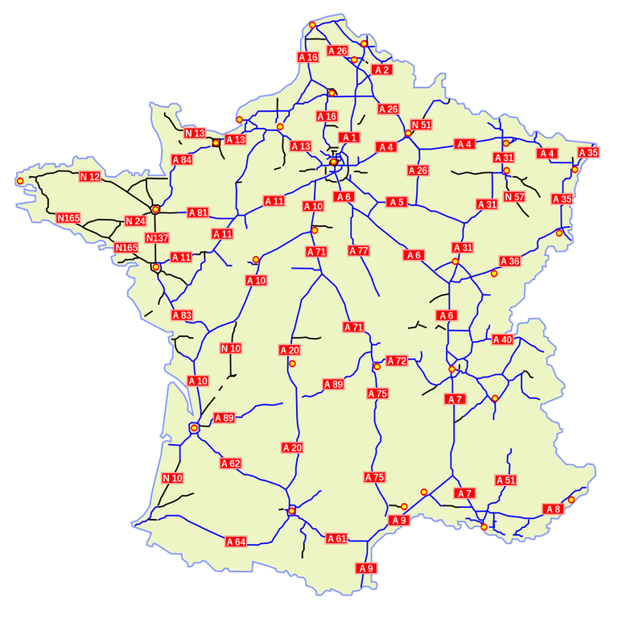

# Saobraćajne nesreće u Francuskoj :fr:

> Mreža autoputeva u Francuskoj<sup>[1]</sup>




Francuska je visokorazvijena zemlja što čini njenu saobraćajnu mrežu gustom i visoko razvijenom.  
Ukupna dužina puteva u Francuskoj iznosi više od 1 miliona kilometara<sup>[2]</sup>, a ukupno oko 45 miliona motorna vozila su u opticaju<sup>[3]</sup>.  
Najveći uzroci saobraćajnih nesreća su:
- konzumiranje alkohola ili psihoaktivnih supstanci
- loši vremenski uslovi
- ljudske greške

Iako fatalnost saobraćajnih nesreća u Francuskoj smanjuje svake godine, na godišnjem nivou više od 3000 ljudi izgubi svoj život<sup>[4]</sup>.  
U ovom projektu bavićemo se uzrocima saobraćajnih nesreća, zašto i u kojoj meri oni utiču na ishod saobraćajne nezgode.


<details>
  <summary>Dataset</summary>

Dataset se sastoji od 6 CSV datoteka koje nam pružaju podatke o:
- samim nesrećama - `characteristics.csv`,
- žrtvama - `users.csv`,
- prevoznim sredstvima - `vehicles.csv`,
- mestima nesreće - `places.csv`,
- prazničnim danima u Francuskoj - `holidays.csv`,
- poštanski kodovi naseljenih mesta1 - `postal-code-insee-2015.csv`.

Vremenski period na koji se podaci odnose je 2005-2016 godine. Veličina skupa podataka je 365 MB.
Brojnost podataka u pojedinačnim datotekama:
- `characteristics.csv` - 839985 rows
- `users.csv` - 1876005 rows
- `vehicles.csv` - 1433389 rows
- `places.csv` - 839985 rows
- `holidays.csv` - 132 rows
- `postal-code-insee-2015.csv` - 36742 rows

Pri izradi projekta je korišćena [MongoDB](https://www.mongodb.com/) dokument baza podataka.

> Dataset link: [kaggle.com][dataset-kaggle]  
> Dataset attributes definition: [link][dataset-attributes] or [PDF](docs/description-des-bases-de-donnees-onisr-annees-2005-a-2018.pdf)  
> French INSEE dataset: [dataset][dataset-insee]

</details>

<details>
  <summary>Obeležja skupa podataka</summary>

### `characteristics.csv`

|Obeležje|Opis|
|--------|----|
Num_Acc|ID nesreće
jour|dan nesreće
mois|mesec nesreće
an|godina nesreće
hrmn|vreme nesreće - sati i minuti (hhmm)
lum|uslovi osvetljenja<br><br>1 - tokom dana<br>2 - suton ili zora<br>3 - noć bez ulične rasvete<br>4 - noć bez uključene ulične rasvete<br>5 - noć sa uličnom rasvetom
dep|INSEE kod za departman sa pratećom nulom
com|opština (dodeljuje INSEE) - trocifren broj
agg|lokalizacija<br><br>1 - van aglomeracije<br>2 - u aglomeraciji
int|tip raskrsnice<br><br>1 - van raskrsnice<br>2 - “X” raskrsnica<br>3 - “T” raskrsnica<br>4 - “Y” raskrsnica<br>5 - raskrsnica sa više od 4 grana<br>6 - kružni tok<br>7 - trg<br>8 - železnički prelaz<br>9 - ostalo
atm|vremenski uslovi<br><br>1 - normalno<br>2 - slaba kiša<br>3 - jaka kiša<br>4 - sneg/grad<br>5 - magla/dim<br>6 - jak vetar/oluja<br>7 - blistavo<br>8 - oblačno<br>9 - ostalo
col|tip sudara<br><br>1 - dva vozila frontalno<br>2 - dva vozila zadnja strana<br>3 - dva vozila bočna strana<br>4 - tri i više vozila u lancu<br>5 - tri i više vozila višestruki sudar<br>6 - ostali sudari<br>7 - bez sudara
adr|adresa nesreće
gps|GPS kod<br><br>M - kontinentalna Francuska<br>A - Antili (Martinik i Gvadelup)<br>G - Francuska Gvajana<br>R - Reinion<br>Y - Majot
lat|geografska širina
long|geografska dužina

### `users.csv`

|Obeležje|Opis|
|--------|----|
Num_Acc|ID nesreće
num_veh|ID vozila
place|mesto žrtve u vozilu<br>
catu|kategorija žrtve<br><br>1 - vozač<br>2 - putnik<br>3 - pešak<br>4 - pešak na rolerima ili trotinetu
grav|težina povrede<br><br>1 - nepovređen<br>2 - fatalni ishod<br>3 - povređen - hospitalozivan<br>4 - lako povređen
sexe|pol žrtve<br><br>1 - muško<br>2 - žensko
trajet|razlog putovanja u vreme nesreće<br><br>1 - na posao<br>2 - u školu<br>3 - kupovina<br>4 - u vezi posla<br>5 - šetnja<br>9 - ostalo
secu|prvi karakter je tip zaštitne opreme<br><br>1 - pojas<br>2 - kaciga<br>3 - dečiji uređaj<br>4 - svetloodbojna oprema<br>9 - ostalo<br><br>drugi karakter je upotreba te opreme<br><br>1 - da<br>2 - ne<br>3 - nepoznato
an_nais|godina rođenja žrtve
locp|lokacija pešaka u trenutku nesreće<br><br>1 - na kolovozu više od 50m od pešačkog prelaza<br>2 - na kolovozu manje od 50m od pešačkog prelaza<br>3 - na pešačkom prelazu bez semafora<br>4 - na pešačkom prelazu sa semaforom<br>5 - na trotoaru<br>6 - u zaustavnoj traci<br>7 - na pešačkom ostrvu<br>8 - na sporednom putu
actp|akcija pešaka<br><br>0 - nepoznato<br>1 - pomeranje u pravac vozila<br>2 - pomeranje u suprotan smer vozila<br>3 - prelazak puta<br>4 - maskiran? (masqué)<br>5 - igra se<br>6 - sa životinjom<br>9 - ostalo
etatp|da li je pešak bio sam ili u grupi<br><br>1 - sam<br>2 - u pratnji<br>3 - u grupi

### `vehicles.csv`

|Obeležje|Opis|
|--------|----|
Num_Acc|ID nesreće
num_veh|ID vozila
senc|smer vožnje/protoka<br><br>0 - nepoznato<br>1 - u rastućem redosledu poštanske adrese ?<br>2 - u opadajućem redosledu poštanske adrese ?
catv|kategorija vozila<sup>[5]</sup><br><br>1 - bicikl<br>2 - moped<br>3 - kolica<br>4 - registrovan skuter<br>5 - motocikl<br>6 - motocikl sa bočnom prikolicom<br>7 - motorno vozilo (automobil)<br>8 - motorno vozilo sa kamp prikolicom<br>9 - motorno vozilo sa prikolicom<br>10 - motorno vozilo (kombi) sa ili bez prikolice<br>11 - VU 10 + kamp prikolica<br>12 - VU 10 + prikolica<br>13 - teretno vozilo (3,5 - 7,5 T)<br>14 - teretno vozilo (> 7,5 T)<br>15 - teretno vozilo (> 3,5 T) + prikolica<br>16 - samo kamion<br>17 - kamion + trejler<br>18 - javni prevoz ?<br>19 - tramvaj<br>20 - specijalna mašina<br>21 - traktor<br>30 - skuter (< 50 cm<sup>3</sup>)<br>31 - motocikl (> 50 cm<sup>3</sup>)<br>32 - skuter (50-125 cm<sup>3</sup>)<br>33 - motocikl (> 125 cm<sup>3</sup>)<br>34 - skuter (> 125 cm<sup>3</sup>)<br>35 - laki četvorocikl (<= 50 cm<sup>3</sup>)<br>36 - teški četvorocikl (> 50 cm<sup>3</sup>)<br>37 - autobus<br>38 - daljinski autobus (coach)<br>39 - voz<br>40 - tramvaj<br>99 - ostalo vozilo
occutc|broj putnika u javnom prevozu
obs|fiksna prepreka sudara<br><br>1 - parkirano vozilo<br>2 - drvo<br>3 - metalna barijera<br>4 - betonska barijera<br>5 - druga barijera<br>6 - konstrukcija/zgrada<br>7 - stub saobraćajnih znakova<br>8 - stubić<br>9 - klupa<br>10 - ograda<br>11 - pešačko ostrvo<br>12 - bankina<br>13 - jarak, nasip, stena<br>14 - druga fiksna prepreka na putu<br>15 - druga fiksna prepreka na trotoaru<br>16 - bez prepreka
obsm|pokretna prepreka sudara<br><br>1 - pešak<br>2 - vozilo<br>4 - šinsko vozilo<br>5 - domaća životinja<br>6 - divlja životinja<br>9 - ostalo
choc|tačka sudara<br><br>1 - prednja<br>2 - desna prednja<br>3 - leva prednja<br>4 - zadnja<br>5 - desna zadnja<br>6 - leva zadnja<br>7 - desna strana<br>8 - leva strana<br>9 - više strana
manv|kretanje/pokret vozila prilikom sudara<br><br>1 - bez promene pravca kretanja<br>2 - isti smer, ista traka<br>3 - između dve trake<br>4 - u rikverc<br>5 - na pogrešan način<br>6 - prelazak preko pešačkog ostrva<br>7 - u autobuskoj traci u istom smeru<br>8 - u autobuskoj traci u suprotnom smeru<br>9 - ubacivanjem između dva vozila<br>10 - polukružno skretanje<br>11 - promena trake u levo<br>12 - promena trake u desno<br>13 - skretanje levo<br>14 - skretanje desno<br>15 - okretanje na levu stranu<br>16 - okretanje na desnu stranu<br>17 - preticanje sa leve strane<br>18 - preticanje sa desne strane<br>19 - prelazak puta<br>20 - parkirni manevar<br>21 - manevri izbegavanja nesreće<br>22 - otvaranje vrata<br>23 - zaustavljeno (nije parkiran)<br>24 - parkiran (sa putnicima)

### `places.csv`

|Obeležje|Opis|
|--------|----|
Num_Acc|ID nesreće
catr|kategorija puta<br><br>1 - autoput<br>2 - nacionalni put<br>3 - motoput<br>4 - javni put<br>5 - van saobraćajne mreže<br>6 - javno parkiralište<br>9 - ostalo
voie|broj (oznaka) puta
V1|numerički indeks broja puta
V2|alfanumerička oznaka puta
circ|režim saobraćaja<br><br>1 - jednosmerno<br>2 - dvosmerno<br>3 - sa odvojenim kolovozima<br>4 - trake promenljive namene
nbv|ukupan broj saobraćajnih traka
vosp|rezervisana saobraćajna traka<br><br>1 - biciklistička staza<br>2 - biciklistička traka<br>3 - rezervisana traka (za spora vozila)
prof|nagib puta na mestu nesreće<br><br>1 - ravan<br>2 - nagib<br>3 - vrh brda<br>4 - dno brda
pr|referentna tačka puta - objašnjenje
pr1|udaljenost u metrima od referentne tačke
plan|oblik puta<br><br>1 - ravan put<br>2 - krivina u levo<br>3 - krivina u desno<br>4 - "S" oblik
lartpc|širina pešačkog ostrva (ako postoji)
larrout|širina kolovoza
surf|površina puta<br><br>1 - normal<br>2 - mokro<br>3 - barice<br>4 - poplavljena<br>5 - sneg<br>6 - blatnjavo<br>7 - ledeno<br>8 - masno (ulje)<br>9 - ostalo
env1|blizina škole (0-99) - *ne zna se šta znače brojevi*
infra|infrastruktura<br><br>1 - podzemlje - tunel<br>2 - most - nadvožnjak<br>3 - petlja ili put za isključivanje/uključivanje<br>4 - železnička pruga<br>5 - raskrsnica<br>6 - pešačka zona<br>7 - naplatna zona
situ|okolnost nesreće<br><br>1 - na kolovozu<br>2 - na zaustavnoj traci<br>3 - na dodatnoj bočnoj traci<br>4 - na trotoaru<br>5 - na biciklističkoj stazi

### `holidays.csv`

|Obeležje|Opis|
|--------|----|
ds|datum praznika
holiday|naziv praznika

### `postal-code-insee-2015`

*Samo su važnija obeležja navedena*

|Obeležje|Opis|
|--------|----|
INSEE_COM|INSEE kod opštine i departmana
CODE_COM|kod opštine
NOM_COM|naziv opštine
CODE_DEPT|kod departmana
NOM_DEPT|naziv departmana
POPULATION|broj stanovnika
GEO_POINT_2D|lista sa vrednostima latitude i longitude

#### Dobijanje INSEE koda od obeležja `dep` i `com` iz fajla `characteristics.csv`

INSEE kod = ddccc  
dd = dvocifren broj dobijen od obeležja dep bez nule sa kraja  
ccc = trocifren broj dobijen od obeležja com

Primeri:
- dep = 620, com = 756, INSEE = 62756
- dep = 590, com = 14, INSEE = 59014
- dep = 20, com = 1, INSEE = 02001

Specijalni slučajevi:
- dep = 201 -> dd = 2A
- dep = 202 -> dd = 2B
- dep brojevi 971, 972, 973, 974, 975 i 976 su prekookeanske teritorije Francuske, te nisu u ovom skupu podataka

</details>

## Primer prostiranja podataka kroz datoteke


## Struktura datoteka

```
+ french-accidents-nosql
| + dataset
| | - characteristics.csv
| | - code-postal-code-insee-2015.csv
| | - holidays.csv
| | - places.csv
| | - users.csv
| | - vehicles.csv
| + loaders
| | + json
| | | - characteristics.json
| | | - holidays.json
| | | - insee.json
| | | - places.json
| | | - users.json
| | | - vehicles.json
| | | - vehiclesByAccident.json
| | - characteristicsLoader.py
| | - usersLoader.py
| | - vehicledLoader.py 
| - README.md
```

## Logička šema

### Model podataka


### Transformacija podataka u formu pogodnu za kreiranje šeme

Transformacijom podataka dobijemo na performansama prilikom popunjavanja baze podataka. Pretvorimo podatke iz običnog csv (comma-seperated values) oblika u json oblik, sa definisanim ključevima za brže pronalaženje tražene torke. Podaci su smešteni u 3 glavne datoteke i 3 pomoćne datoteke kao JSON objekti koje je moguće deserijalizovati u Python rečnike. Te datoteke sadrže sledeće strukture:

- characteristics.json:
    ```json
    {
        "201600000001": {
            "date": ...,
            "col": ...,
            "int": ...,
            "holiday": ...,
            "location": {
                "com": ...,
                "dep": ...
            },
            "road": {
                "catr": ...,
                "condition": {
                    ...
                }
            }
            ...
        },
        "201600000002": {
            ....
        }
    }
    ```
    > Ključ je ID nesreće, vrednost je podaci o nesrećama.
- users.json:
    ```json
    {
        "201600001-A01": [
            {
                "catu": ...,
                "place": ...,
                "grav": ...,
                "sexe": ...,
                ...
            },
            {
                ...
            }
        ],
        "201600001-B01": [
            {
                ...
            }
        ]
    }
    ```
    > Ključ je kombinacija ID nesreće i ID vozila. Vrednost je lista učesnika u saobraćaju.
- vehiclesByAccident.json:
    ```json
    {
        "2016000001": [
            {
                "catv": ...,
                "senc": ...,
                "occutc": ...,
                "obstacle": {
                    "obs": ...,
                    "obsm": ...
                }
                ...
            },
            {
                ...
            }
        ],
        "2016000002": [
            {
                ...
            }
        ]
    }
    ```
    > Ključ je ID nesreće, vrednost je lista vozila koji su učestvovali u nesreći.
- vehicles.json:
    ```json
    {
        "2016000001-A01": {
                "catv": ...,
                "senc": ...,
                "occutc": ...,
                "obstacle": {
                    "obs": ...,
                    "obsm": ...
                }
                ...
        }
        ,
        "2016000002-B02": {
                ...
        }
    }
    ```
    > Ključ je ID nesreće i oznaka vozila, vrednost je vozilo koje je učestvovalo u nesreći.
- holidays.json:
    ```json
    {
        "2016-01-01": "New year",
        "2016-05-01": "Labours day",
        ...
    }
    ```
    > Ključ je datum praznika, vrednost je ime praznika.
- insee.json:
    ```json
    {
        "34547": {
            "com": ...,
            "dep": ...,
            "population": ...,
            "lat": ...,
            "long": ...
        },
        "28456": {
            ...
        }
    }
    ```
    > Ključ je INSEE kod opštine, vrednost su podaci o opštini.
- places.json:
    ```json
    {
        "2016000001": {
            "catr": ...,
            "condition": {
                ...
            },
            ...
        },
        "2016000002": {
            ...
        }
    }
    ```
    > Ključ je ID nesreće, vrednost je podaci o mestu nesreće.

### Šema

#### Accidents collection - [`accidentsCollection.py`](loaders/accidentsCollection.py)

```
Accident {
    Num_Acc
    date
    holiday
    col
    int
    condition: { 
        lum
        atm
    }
    location: { 
        gps
        lat
        long
        com
        dep
        population
    }
    road {
        catr
        voie
        circ
        nbv
        condition: {
            prof
            plan
            surf
        }
        infra
        situ
    }
    vehicles: [
        {
            num_veh
            catv
            senc
            occutc
            obstacle: {
                obs
                obsm
            }
            choc
            manv
            users: [
                {
                    catu
                    place
                    grav
                    sexe
                    an_nais
                    trajet
                    sec     - bezbednosna oprema
                    secutil - da li je koristio opremu (true/false)
                    locp
                    actp
                    etatp
                },
                ...
            ]
        },
        ...
    ]
}
```

#### Users collection - [`usersCollection.py`](loaders/usersCollection.py)

```json
user: {
    catu
    place
    grav
    sexe
    an_nais
    trajet
    sec     - bezbednosna oprema
    secutil - da li je koristio opremu (true/false)
    locp
    actp
    etatp
    accident: {
        Num_Acc
        date
        holiday
        col
        int
        condition: { 
            lum
            atm
        }
        location: { 
            gps
            lat
            long
            com
            dep
            population
        }
        road {
            catr
            voie
            circ
            nbv
            condition: {
                prof
                plan
                surf
            }
            infra
            situ
        }
    }
    vehicle: {
        num_veh
        catv
        senc
        occutc
        obstacle: {
            obs
            obsm
        }
        choc
        manv
    }
}
```

## Taskovi

### Gergelj

1. Da li su kružni tokovi ili raskrsnice opasnije:
- u normalnim uslovima?
- kada je površina puta mokra?
2. U zavisnosti od starosti kolika je verovatnoća da će vozač udariti pešaka prilikom udesa?
3. Koliko životinja je izazvao saobraćajnu nesreću na putevima Francuske? Da li je broj veći noću ili tokom dana?
4. Koliko prosečno ima teško povređenih i preminulih u saobraćajnim nesrećima u zavisnosti od korišćenja ili ne korišćenja sigurnosne opreme?
5. Da li se prosečno desi više teških nesreća tokom prazničnih dana?

### Stefan

1. Odnos povreda i broj saobraćajnih nesreća pri sudaru sa domaćim i divljim životinjama na putu
2. Poređenje verovatnoće teških povreda vozača i suvozača motocikala i automobila
3. Poređenje broja udesa tokom noći, van urbanog područija sa i bez osvetljenja kada vozač vozi sam i kada ima putnike
4. Poređenje broja sudara vozila i pešaka i težine povreda pešaka prilikom preticanja, skretanja i bez promene pravca u urbanom području
5. Poređenje smrtnih ishoda vozača automobila i suvozača u istom frontalnom sudaru


[1]: https://en.wikipedia.org/wiki/Transport_in_France
[2]: http://www.iraptranstats.net/fr/
[3]: https://www.acea.be/statistics/tag/category/report-vehicles-in-use
[4]: https://etsc.eu/wp-content/uploads/14-PIN-annual-report-FINAL.pdf
[5]: https://www.autoroutes.fr/fr/classification-des-vehicules.htm
[dataset-kaggle]: https://www.kaggle.com/ahmedlahlou/accidents-in-france-from-2005-to-2016
[dataset-attributes]: https://www.data.gouv.fr/en/datasets/bases-de-donnees-annuelles-des-accidents-corporels-de-la-circulation-routiere-annees-de-2005-a-2019/
[dataset-insee]: https://data.opendatasoft.com/explore/dataset/code-postal-code-insee-2015%40public/information/
