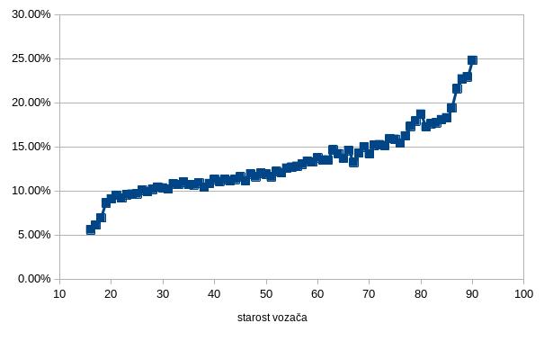
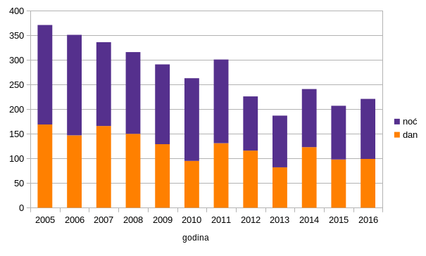

# Taskovi

## Gergelj

### 1. Da li su kružni tokovi ili raskrsnice opasnije:
- u normalnim uslovima?
- kada je površina puta mokra?

#### Rezultati:

||NORMALNI USLOVI|NENORMALNI USLOVI|
|---|------------|-----------------|
|RASKRSNICE|15,79%|14,14%|
|KRUŽNI TOKOVI|21,59%|20,68%|

Brojevi pokazuju opasnost saobraćajnih nesreća koji su izračunati kao odnos broja učesnika sa teškim povredama ili su preminuli usled nesreće, sa ukupnim brojem učesnika u nesrećima. Vidimo da stanje površine puta nije mnogo uticalo na opasnost nesreće (procentualno čak i više ljudi zadobije teže povrede u normalnim okolnostima - pažljivije upravljanje vozilom kada su putevi klizavi). Međutim razlika se vidi kod tipa raskrsnice: u kružnim tokovima je znatno veći broj onih koji su dobili teže povrede ili su umrli.

### 2. U zavisnosti od starosti kolika je verovatnoća da će vozač udariti pešaka prilikom udesa?

#### Rezultati:

### 3. Koliko životinja je izazvao saobraćajnu nesreću na putevima Francuske? Da li je broj veći noću ili tokom dana?

#### Rezultati:

Uglavnom veći broj životinja izazove saobraćajne nesreće noću, izuzev godine 2012 i 2014.

### 4. Koliko prosečno ima teško povređenih i preminulih u saobraćajnim nesrećima u zavisnosti od korišćenja ili ne korišćenja sigurnosne opreme?

|KORIŠĆENJE SIGURNOSNE OPREME|PROSEČAN BROJ TEŠKO POVREĐENIH ILI PREMINULIH|
|---|---|
|DA|0,419|
|NE|0,605|

Iz rezultata se vidi da ukoliko učesnik u saobraćaju ne koristi pojas, kacigu itd. ima 60% šansi da bude teško povređen ili da umre usled nesreće, dok sa korišćenjem sigurnosne opreme u 60% slučajeva će učesnik preživeti nesreću sa ili bez lakih povreda.

### 5. Da li se prosečno desi više teških nesreća tokom prazničnih dana?

a) Za tešku nesreću sam uzeo te nesreće gde je bar jedan učesnik preminuo.

|PRAZNIK|PROCENAT TEŠKE NESREĆE|
|---|---|
|DA|7,49%|
|NE|5,51%|

b) Za tešku nesreću sam uzeo te nesreće gde je bar jedan učesnik preminuo ili dobio teške povrede.

|PRAZNIK|PROCENAT TEŠKE NESREĆE|
|---|---|
|DA|51,05%|
|NE|43,68%|

## Stefan

