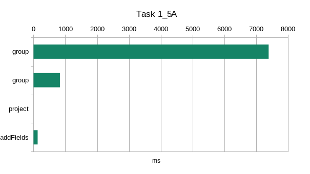

# Performanse

|||
|---|---|
|  |   |
|  |   |
| |  |

Iz rezultata izvršenja samih upita se vidi da u svakom upitu `group` pipeline usporava izvršenje, posebno ona grupisanja gde se prebrojava veća količina dokumenata (uslovno ili bezuslovno).

## Korišćenje indeksa

Za Task 1_1 je iskorišćen indeks `int` (tip raskrsnice) napravljen nad kolekcijom `accidents`:

